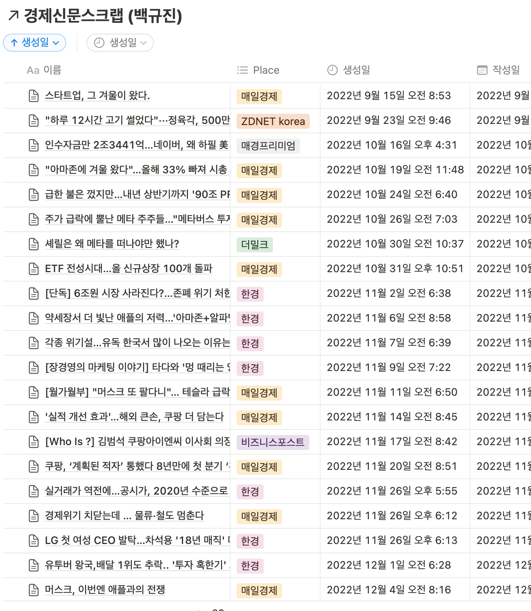
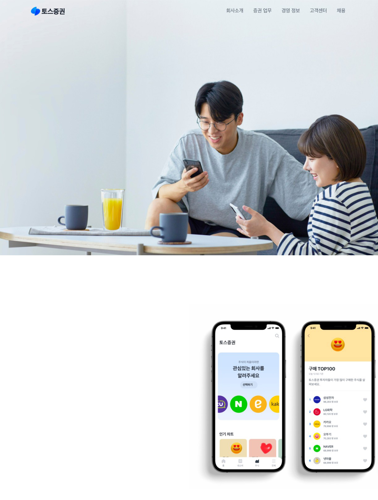
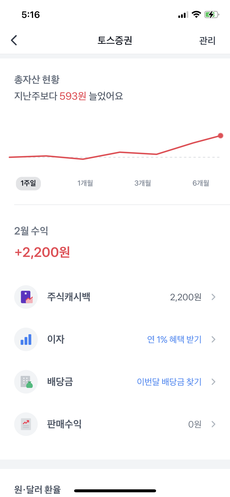
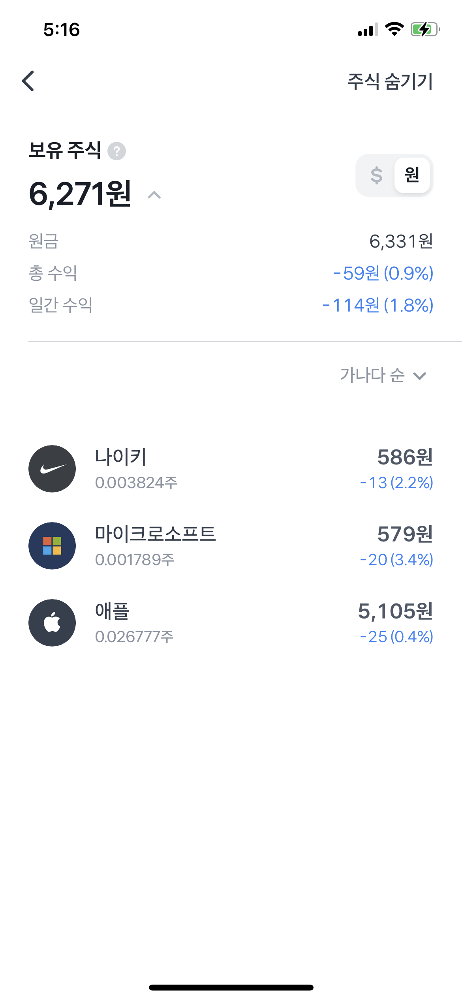
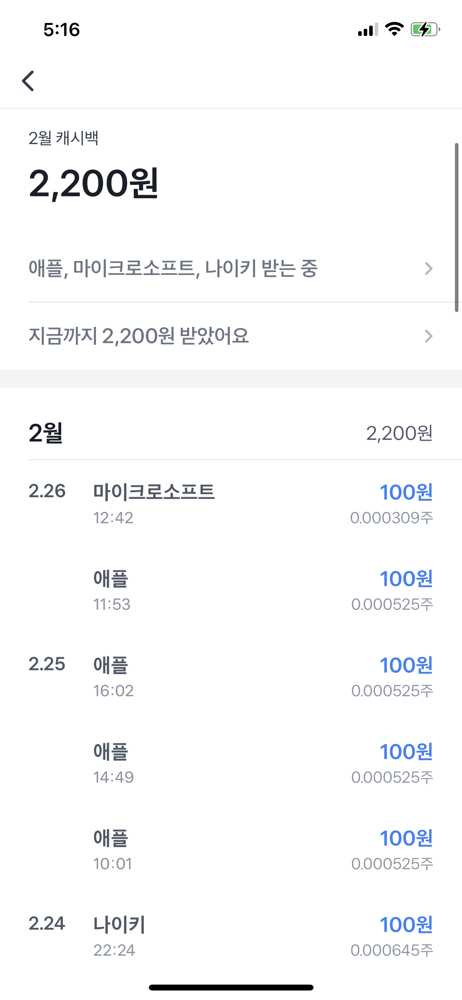
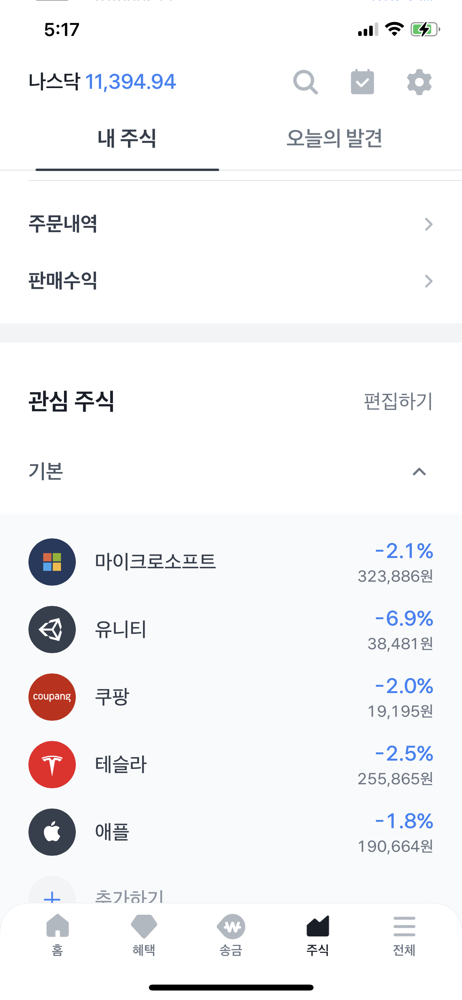
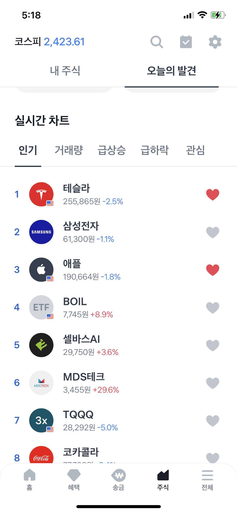

<!-- 여기는 제목 -->

# 2023 Start

### 23 Year_Kick Off

---

# 투자 그리고 종목분석

- 신문스크랩 (2) & 종목분석 (1)

- 1M 2W 투자종목 이슈 트래킹

- 1M 4W 포트폴리오 현황 및 점검

- Toss 어플

---

# 신문스크랩 (2)

### & 종목분석 (1) &nbsp; [🔗](https://www.notion.so/koolbaek/Ver-1-5-5587400a01344055a889fa39970e62c8?pvs=4)

- 한주당 신문스크랩 2개

- 투자중인 종목분석 1개

- 동일한 갯수 제한중 종목분석
  카테고리가 생성됨

---

# 1Month 2W 투자종목 이슈 트래킹

- 이전 컨텐츠와 동일하게 투자종목에 대한
  이슈들을 정리하며 관련 종목에 대해서 분석하고
  자신만의 생각을 정리하는 컨텐츠를 만든다.

- 하반기중에 유투브 채널 오픈예정

---

# 1M 4W 포트폴리오 현황 및 점검

- 금전적인 부분이 부담스럽다면 블러 및 현황에 대한 안내가능

- 구글밋으로 관련 발표진행

- 추후 발표 녹화예정

---

# Toss App

- 거래내역
- 현재 주식 내역
- 종목 거래 내역 확인
- 관심 주식
- 카테고리별 주식 현황

---

# 거래내역

- 한눈에 거래내역을 확인 가능함

---

# 현재 주식 내역

- 소액으로 투자 가능함

---

# 종목 거래 내역확인

- 주별로 주식 구매를 할 수 있음
- 캐시백으로 3월까지 받을 수 있음

---

# 관심주식

- 관심주식 설정시, 해당 주식의
  이슈를 알림으로 확인이 가능함

---

# 카데고리별 주식 현황

- 카데고리별 주식을 분류로
  확인이 가능함

