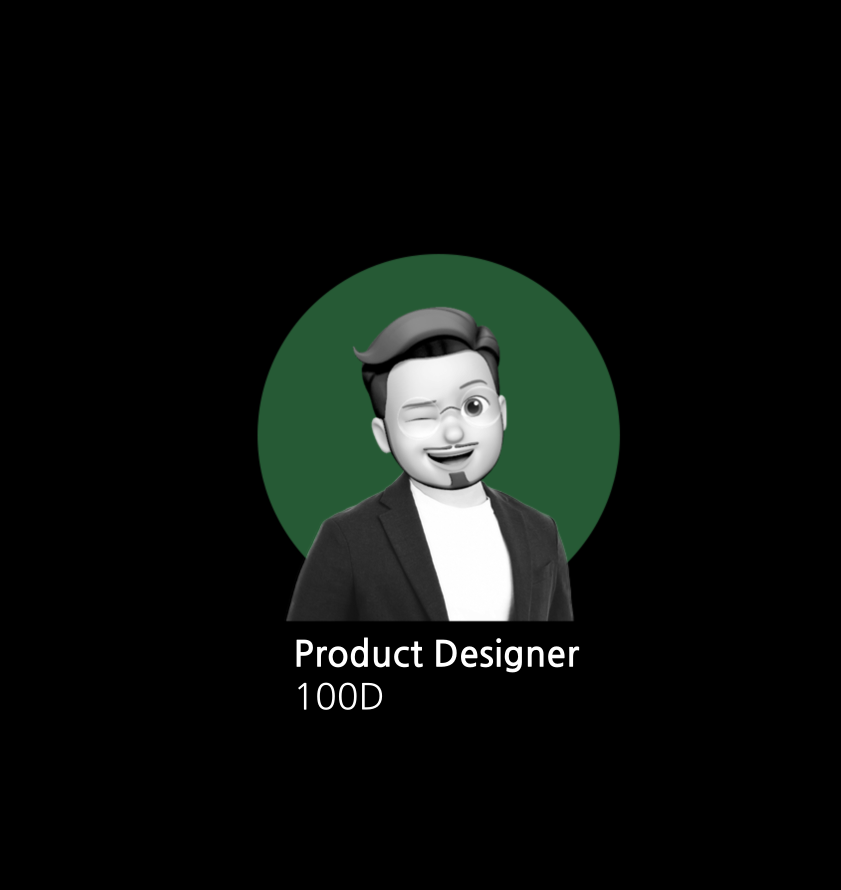
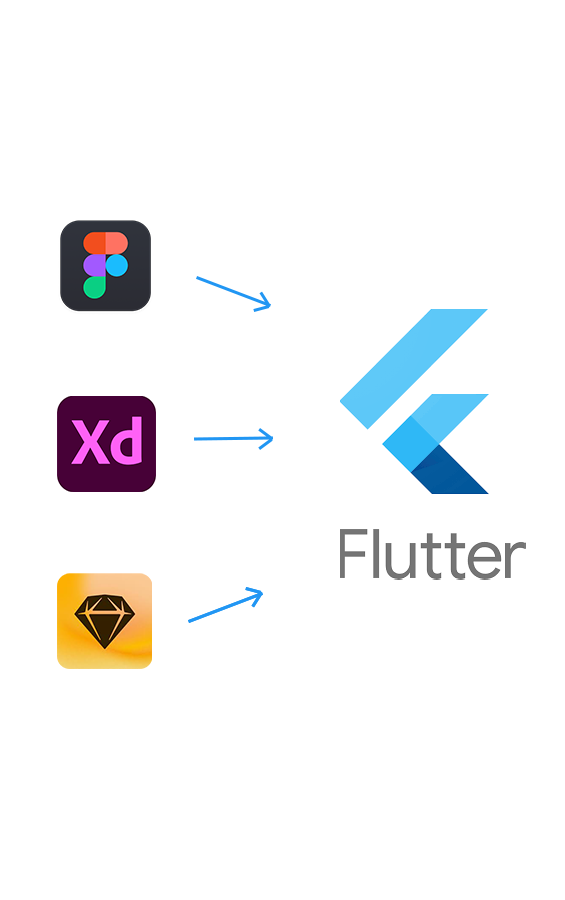
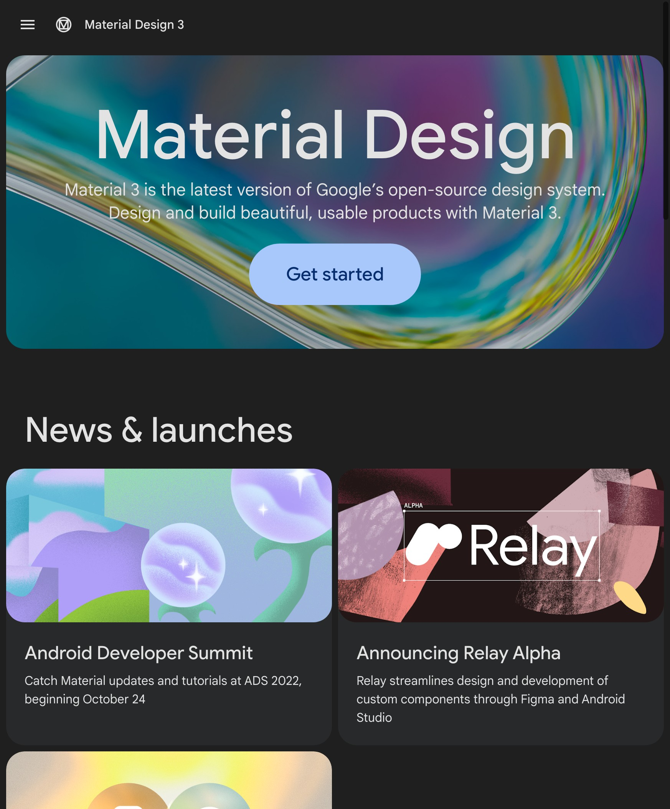
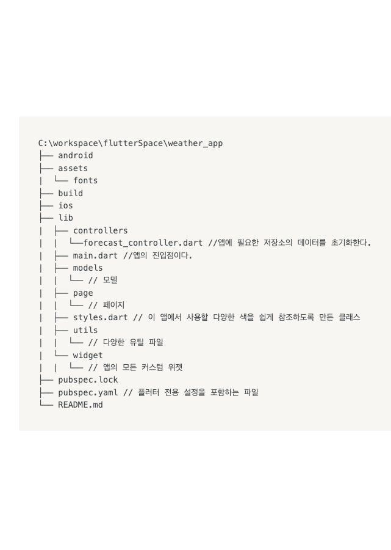
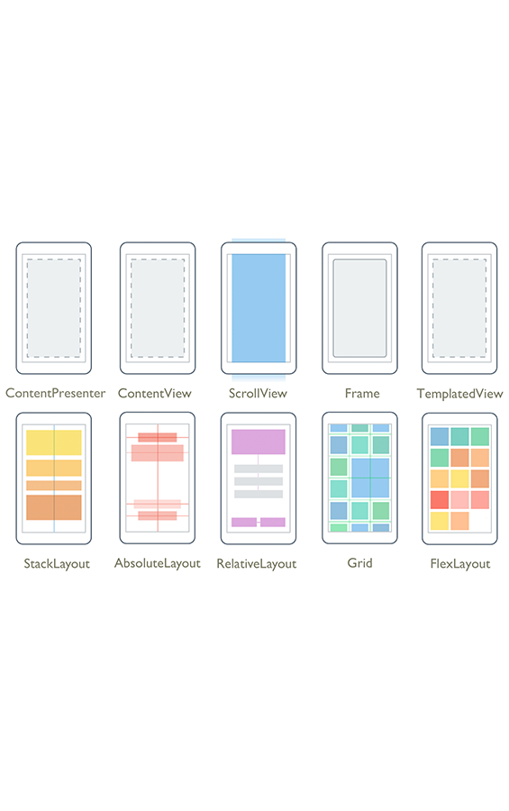
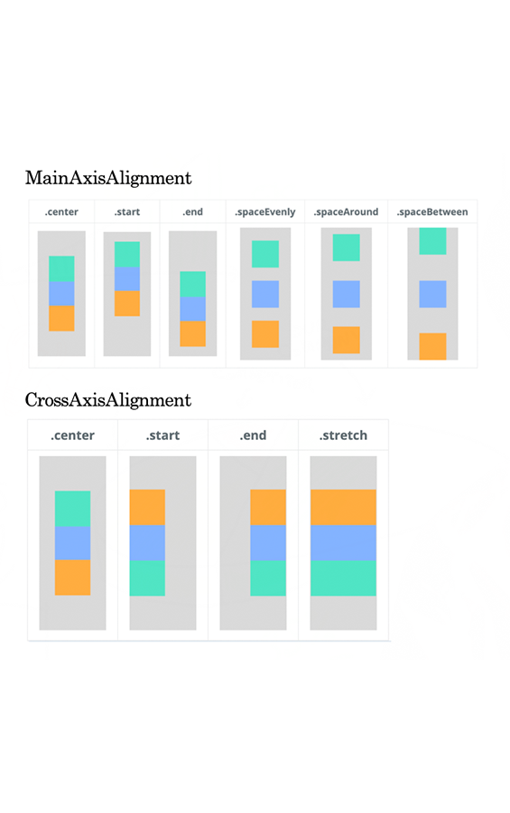
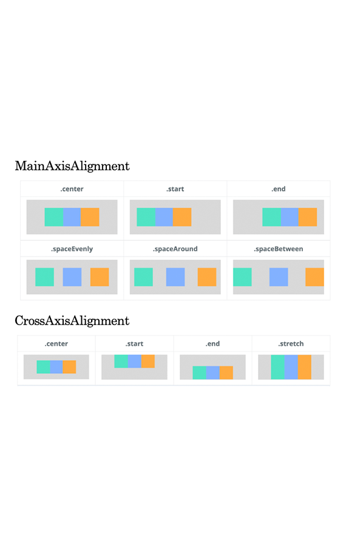
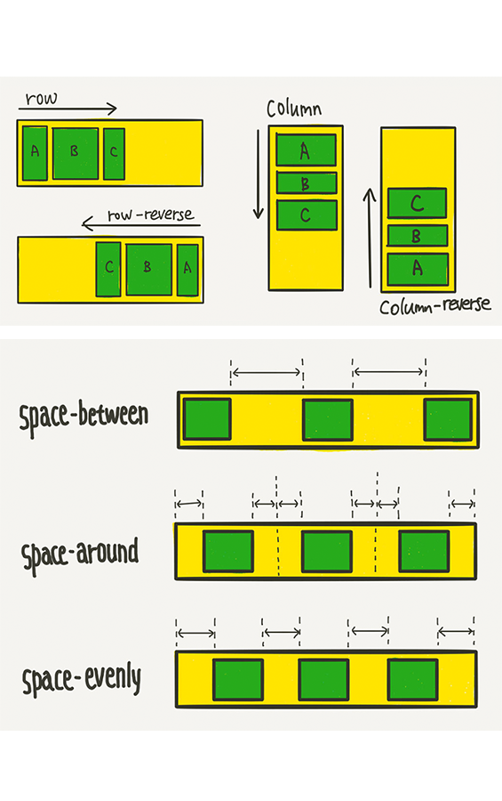

<style>
    
  @import url('https://fonts.googleapis.com/css2?family=Do+Hyeon&family=Dongle:wght@300;400;700&family=Montserrat:ital,wght@0,100;0,200;0,300;0,400;0,500;0,600;0,700;0,800;0,900;1,100;1,200;1,300;1,400;1,500;1,600;1,700;1,800;1,900&family=Noto+Serif+KR:wght@600&family=Poppins:ital,wght@1,600&display=swap');

   @import url('https://cdn.jsdelivr.net/gh/orioncactus/pretendard/dist/web/static/pretendard.css');
      * {
        font-family: 'Pretendard', serif;
      }
      @keyframes AnimationName {
        0% {
          background-position: 0% 50%;
        }
        50% {
          background-position: 100% 50%;
        }
        100% {
          background-position: 0% 50%;
        }
      }


section{
    font-family:'Noto Serif KR';
    background: linear-gradient(-45deg, #343434, #282a36, #44475a, #6272a4 );
        background-size: 300% 300%;
        animation: AnimationName 6s infinite;background: linear-gradient(-45deg, #343434, #282a36, #44475a, #6272a4);
        background-size: 300% 300%;
        animation: AnimationName 6s infinite;
}
section{
    color:#fff;
}

h1{ color:#fff}

</style>

<!-- 여기는 제목 -->

# Flutter

### Kick Off Meeting

<br> Implement Any UI in Flutter
<br>

<style scoped>
h1 {
   font-family: 'Montserrat', sans-serif;
    padding-top: 0.5em;
    color:#f8f8f8;
    font-size:2.5em;
}

h3{ font-family:'Noto Serif KR';}
section{
    background:#101010;
    color:#fff;
}
span{
    font-size:0.8em;
}
</style>



---

<style scoped>
    h1{font-family: 'Poppins', sans-serif;}
    section{ color:#00AA8B;}
</style>

# How to Implement Any UI in Flutter

- UI Base Theme

- Flutter UI

- Layout Axis

- Style Guide



---

<style scoped>
   h1{font-family: 'Poppins', sans-serif;}
    h1 {
    padding-bottom: 0em;
    color:#00AA8B;
}
</style>

# UI Base Theme

### M3 &nbsp; [🔗](https://m3.material.io/)

- 디지털 경험을 만드는 도구를 결합한 통합 시스템

- 구글의 플랫디자인 기반 디자인

- Components [🔗](https://m3.material.io/components/cards/overview)

- Implement in Flutter [🔗](https://api.flutter.dev/flutter/material/Card-class.html)



---

<style scoped>
    h1{font-family: 'Poppins', sans-serif;}
    h1 {
    padding-bottom: 0.5em;
    color:#00AA8B;
}
</style>

# Flutter UI

- MaterialApp **OR** CupertinoApp

- Scaffold

- AppBar

- Theme



---

# MaterialApp OR CupertinoApp

```dart
void main() { // 앱 진입점
  WidgetsFlutterBinding.ensureInitialized();
  AppSettings settings = AppSettings();

  // Don't allow landscape mode
  SystemChrome.setPreferredOrientations(
          [DeviceOrientation.portraitUp, DeviceOrientation.portraitDown])
      .then((_) => runApp(MyApp(settings: settings)));
}

class MyApp extends StatelessWidget {
  final AppSettings settings;

  const MyApp({Key key, this.settings}) : super(key: key);

  @override
  Widget build(BuildContext context) {
    //...
    return MaterialApp( // --- (1)
      title: 'Weather App',
      debugShowCheckedModeBanner: false, // --- (2)
      theme: theme, // --- (3)
      home: PageContainer(settings: settings), // --- (4)
    );
  }
}
```

<style scoped>
    h1{font-family: 'Poppins', sans-serif;}
    
section{
    color:#555;
    font-size:1em;
}
h1 {
    padding-bottom: 0em;
    color:#00AA8B;
    font-size:2em;
}
</style>

---

# Scaffold

```dart
const Scaffold({
	Key key,
	this.appBar,
	this.body,
	this.floatingActionButton,
	this.floatingActionButtonLocation,
	this.floatingActionButtonAnimator,
	this.persistentFooterButtons,
	this.drawer,
	this.endDrawer,
	this.bottomNavigationBar,
	this.bottomSheet,
	this.backgroundColor,
	this.resizeToAvoidBottomPadding = true,
	this.primary = true,
}) : assert(primary != null), super(key: key);
```

<style scoped>
    h1{font-family: 'Poppins', sans-serif;}
    
section{
    color:#555;
    font-size:1em;
}
h1 {
    padding-bottom: 0em;
    color:#00AA8B;
    font-size:2em;
}
</style>

---

# AppBar

```Dart
return Scaffold(
      appBar: PreferredSize( //---(1)
        preferredSize: Size.fromHeight(ui.appBarHeight(context)),// --- (2)
        child: TransitionAppbar(...) // ---(3)
				),
      );
```

<style scoped>
    h1{font-family: 'Poppins', sans-serif;}
    
section{
    color:#555;
    font-size:1em;
}
h1 {
    padding-bottom: 0em;
    color:#00AA8B;
    font-size:2em;
}
</style>

---

# Theme

```dart
final theme = ThemeData(
    fontFamily: "Cabin",
    primaryColor: AppColor.midnightSky, // --- (1)
    accentColor: AppColor.midnightCloud,
    primaryTextTheme: Theme.of(context).textTheme.apply( // --- (2)
          bodyColor: AppColor.textColorDark,
          displayColor: AppColor.textColorDark,
        ),
    textTheme: Theme.of(context).textTheme.apply(
          bodyColor: AppColor.textColorDark,
          displayColor: AppColor.textColorDark,
        ),
  );
```

<style scoped>
    h1{font-family: 'Poppins', sans-serif;}
    
section{
    color:#555;
    font-size:1em;
}
h1 {
    padding-bottom: 0em;
    color:#00AA8B;
    font-size:2em;
}
</style>

---

<style scoped>
    h1{font-family: 'Poppins', sans-serif;}
    h1 {
    padding-bottom: 0.5em;
    color:#00AA8B;
}
</style>

# Layout Axis

- Column

  - MainAxis
  - CrossAxis

- Row

  - MainAxis
  - CrossAxis



---

# Column

```dart
Column(
  mainAxisAlignment: MainAxisAlignment.center,
  mainAxisSize: MainAxisSize.max,
  crossAxisAlignment: CrossAxisAlignment.center,
  children: [
    Container(
      padding: const EdgeInsets.all(0.0),
      color: Colors.cyanAccent,
      width: 80.0,
      height: 80.0,
    ),
    Container(
      padding: const EdgeInsets.all(0.0),
      color: Colors.blueAccent,
      width: 80.0,
      height: 80.0,
    ),
    Container(
      padding: const EdgeInsets.all(0.0),
      color: Colors.orangeAccent,
      width: 80.0,
      height: 80.0,
    ),
  ],
  ),
```



<style scoped>
    h1{font-family: 'Poppins', sans-serif;}
    
section{
    color:#555;
    font-size:1em;
}
h1 {
    padding-bottom: 0em;
    color:#00AA8B;
    font-size:2em;
}
</style>

---

# Row

```dart
Row(
  mainAxisAlignment: MainAxisAlignment.center,
  mainAxisSize: MainAxisSize.max,
  crossAxisAlignment: CrossAxisAlignment.center,
  children: [
  Container(
    padding: const EdgeInsets.all(0.0),
    color: Colors.cyanAccent,
    width: 80.0,
    height: 80.0,
  ),
  Container(
    padding: const EdgeInsets.all(0.0),
    color: Colors.blueAccent,
    width: 80.0,
    height: 80.0,
  ),
  Container(
    padding: const EdgeInsets.all(0.0),
    color: Colors.orangeAccent,
    width: 80.0,
    height: 80.0,
  ),
  ],
),
```



<style scoped>
    h1{font-family: 'Poppins', sans-serif;}
    
section{
    color:#555;
    font-size:1em;
}
h1 {
    padding-bottom: 0em;
    color:#00AA8B;
    font-size:2em;
}
</style>

---

# Flex css

```css
.container {
  justify-content: flex-start;
  /* justify-content: flex-end; */
  /* justify-content: center; */
  /* justify-content: space-between; */
  /* justify-content: space-around; */
  /* justify-content: space-evenly; */
}

.container {
  flex-wrap: wrap;
  align-content: stretch;
  /* align-content: flex-start; */
  /* align-content: flex-end; */
  /* align-content: center; */
  /* align-content: space-between; */
  /* align-content: space-around; */
  /* align-content: space-evenly; */
}
```



<style scoped>
    h1{font-family: 'Poppins', sans-serif;}
    
section{
    color:#555;
    font-size:1em;
}
h1 {
    padding-bottom: 0em;
    color:#00AA8B;
    font-size:2em;
}
</style>

---

<style scoped>
   h1{font-family: 'Poppins', sans-serif;}
    h1 {
    padding-bottom: 0em;
    color:#00AA8B;
}
</style>

# Style Guide

<!-- ### AS-IS &nbsp; [🔗](https://xd.adobe.com/view/92809efa-41b4-4b15-99f0-936a2fdf9ac3-c7d3/screen/dd8fd952-9869-4e2d-a40b-254e27590be7) -->

<!-- ### Prototype &nbsp; [🔗](https://xd.adobe.com/view/f675a98e-3c67-428f-ad17-7cf3419fee0b-a326/) -->

<!-- ### TO-BE &nbsp; [🔗](https://xd.adobe.com/view/4c0da597-b93c-4f85-b7ad-60358d618150-195e/) -->

<!-- - Notion &nbsp; [🔗](https://www.notion.so/koolbaek/Flutter-1259ac2c0a074f9782c2635c0c04e961?pvs=4) -->


---

<style scoped>
    h1{font-family:'Noto Serif KR';}
    h1 {
    padding-bottom: 0.5em;
     color:#00D063;
}
h2{color:#00A192}
</style>

## 추가 논의 예정

- mov Icon [🔗](<https://www.imagetoday.co.kr/xsearch/preview/?s_menu=membership&mode=search&search=(ta0123t00025*%20%EC%B1%97%EB%B4%87)%2C%20(ta0123t00026*%20%EC%B1%97%EB%B4%87)&multi_offer=6%7C&offer_type=6%7C&pre_offer_type=6%7C&s_menu=membership&view_type=total&search_type=single&parent_arr=0&theme_year=0&theme_month=0&search_box=&rank_by=&rank_mode=balanced&textspace_membership=&adult=N&substitute=N&scroll=&file_ext=&shape=&media_type=&bm=prmov_footage&resolution=all&ae_version=all&sampling=N&page=1&perpage=10&totalpage=&theme_seq=&img_offer_type=&total_count=12&SearchFilter=ServiceDate:[*%20TO%202023-02-21T15:00:00Z],InsertDate:[*%20TO%202023-02-21T16:30:00Z],ApprovalStatus:1,!(__%EB%AF%BC%EA%B0%90%ED%95%9C%EC%BD%98%ED%85%90%EC%B8%A0),{!tag=ot}OfferType:(6)&scroll=0&img_code=ta0123t000264&img_seq=7095813&img_idx=4&sort=3&theme_seq=&search=(ta0123t00025*%20%EC%B1%97%EB%B4%87)%2C%20(ta0123t00026*%20%EC%B1%97%EB%B4%87)&cmd=search>)
- interaction [🔗](https://codepen.io/iamevg/pen/JXpEYz)
- Splash [🔗](https://codepen.io/winkerVSbecks/pen/oLmqQo)
- Web Font & image font -> Web Font [🔗](https://www.sandollcloud.com/webfont)
- API 관련 예)Textview [🔗](https://developer.android.com/guide/topics/ui/look-and-feel/autosizing-textview?hl=ko)
